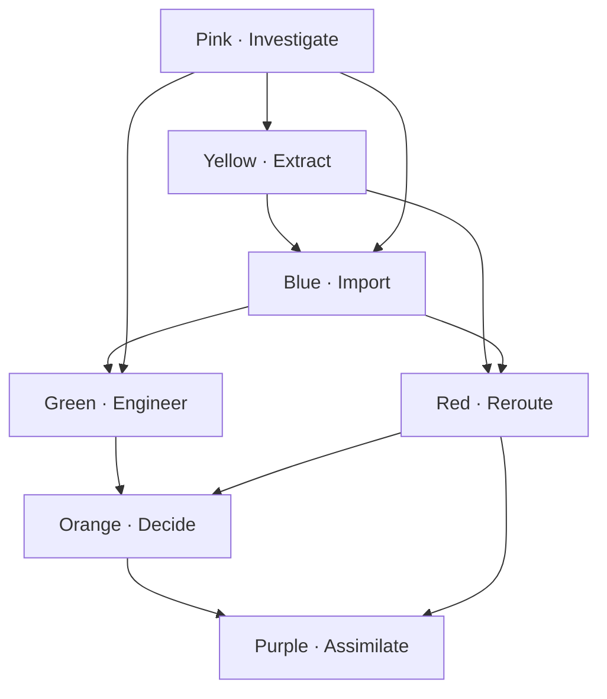
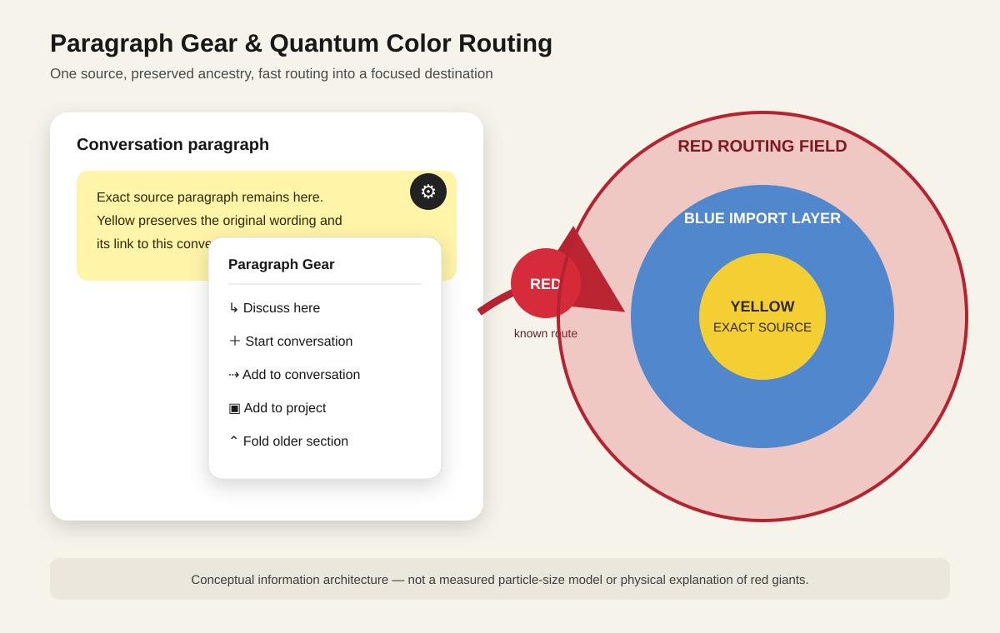

# Infinity Color State Machine

This directory defines the secondary navigation and robot-routing language used across the Infinity project catalog.

The colors describe the **present operation on a work block**. They are not decorative labels and they do not prove that work is complete. A conversation may contain several blocks with different colors.

## Master registry

| Color | Code | Operation | Entry evidence | Exit condition |
|---|---|---|---|---|
| 🟡 Yellow | `yellow` | Exact extraction | A source passage or artifact has been identified | The selected material is preserved word for word with its source |
| 🔵 Blue | `blue` | Import | Extracted or external material has a named destination | The material is placed in the destination with an import receipt |
| 🟢 Green | `green` | Engineering | A defined requirement is ready to build | Code, documentation, or another original solution is implemented and verified |
| 🔴 Red | `red` | Reroute | The present path failed or belongs elsewhere, and a destination is known | The work is copied or redirected without losing its source trail |
| 🟠 Orange | `orange` | CEO decision | Evidence exists but a strategic choice or pivot is required | A decision, owner, reason, and next color are recorded |
| 🟣 Purple | `purple` | Assimilation | Two or more compatible inputs need to become one system | The combined model identifies agreements, corrections, gaps, and interfaces |
| 🌸 Pink | `pink` | Investigate | A claim, anomaly, blocker, or unknown requires evidence | Findings, sources, confidence, and the next operation are recorded |

## Non-negotiable Yellow rule

Yellow is pure extraction:

- preserve the selected source word for word;
- do not code;
- do not correct;
- do not summarize;
- do not fill in blanks;
- do not guess;
- do not allow another color's work to alter the extracted text.

Interpretation belongs in a separate Pink, Orange, Purple, or Green block that points back to the immutable Yellow block.

## Color relationships

The system is fluid rather than a forced linear workflow.

- Yellow + Blue can produce Green when exact source material has been imported and is ready to engineer.
- Yellow + Red can produce Orange when extracted evidence is rerouted into an executive decision.
- Blue + Red can produce Purple when imported material from different paths is assimilated.
- Pink may interrupt any state when evidence is missing.
- Red requires a known destination. If no destination is known, remain Pink.
- Green requires verification evidence. A commit or claim by itself is not enough.

A common path is:

This diagram is an example, not a mandatory sequence.

## Work-block record

Every label must attach to a distinct block, not merely to an entire conversation.

Required fields:

| Field | Meaning |
|---|---|
| `id` | Stable block identifier |
| `title` | Short human-readable name |
| `color` | Current operation |
| `project` | Canonical project or repository |
| `source_refs` | Conversation, file, URL, issue, PR, or commit references |
| `destination` | Intended repository/file/thread when applicable |
| `evidence` | Facts supporting the label |
| `status` | `queued`, `active`, `blocked`, `review`, or `complete` |
| `confidence` | `low`, `medium`, or `high` |
| `next_color` | Proposed next operation, never an automatic command |
| `verification` | Checks required before completion |
| `updated_at` | ISO-8601 timestamp |

See [schema.json](schema.json) for the machine-readable catalog contract and [catalog.example.json](catalog.example.json) for the initial example.

## Paragraph-level routing

The [Paragraph Gear and Swipe Router](PARAGRAPH_GEAR.md) makes each text block addressable without deleting or rewriting its source. Its actions and receipts follow [paragraph-action.schema.json](paragraph-action.schema.json). The [Quantum Color Mapping](QUANTUM_COLOR_MAPPING.md) records the nested red–blue–yellow information model, its proposed physical analogy, and the established-physics boundary.

## Robot routing rules

1. Split a conversation into independently actionable blocks.
2. Preserve exact quotations as Yellow records before interpreting them.
3. Resolve each block to one canonical project and destination.
4. Assign one present color. Store earlier colors in `history`.
5. Cite the evidence used for the classification.
6. If evidence is missing or contradictory, choose Pink.
7. Never claim Blue unless an import receipt, file, PR, or commit exists.
8. Never claim Green unless the implementation and its verification are available.
9. Never choose Red until the destination is identified.
10. Never execute an Orange decision that requires human authority without recorded approval.
11. Never expose private conversation text, credentials, personal information, or restricted material in a public repository.
12. Keep source text and robot interpretation in separate fields.

## Conversation scanning and Gemini

An authenticated browser or connector may read conversations only within the access granted by the account owner. The scanner should first create a **reviewable proposed-label queue**. It must not silently rewrite, publish, delete, or move conversations.

Recommended flow:

1. Read conversation metadata and permitted content.
2. Split it into candidate blocks.
3. Preserve relevant exact source excerpts in a private Yellow store.
4. Propose color, project, destination, evidence, and confidence.
5. Send low-confidence and Orange decisions to human review.
6. Write approved metadata to the catalog.
7. Export only non-sensitive summaries and references to public GitHub.
8. Record imports with repository, path, branch, commit, and timestamp.

Gemini, ChatGPT, or another approved robot may operate as the classifier. The schema and routing rules remain the shared contract so different robots follow the same paths.

## Privacy boundary

GitHub is the public architecture and status layer, not a raw archive of private chats. Exact conversation text should remain private unless it has been deliberately reviewed and approved for publication. Public records should normally store a summary, source reference, classification evidence, and destination.

## Repository placement

The canonical specification lives in the root `INFINITY` repository. Project repositories may link to this directory and keep their own `color-state.json` records without copying the entire standard.

## Definition of done

This standard becomes Green only when:

- the schema validates;
- example catalog records validate against it;
- the root README links to this directory;
- at least one real conversation is classified through human review;
- an import receipt points to the resulting GitHub commit;
- no private material was published accidentally.
