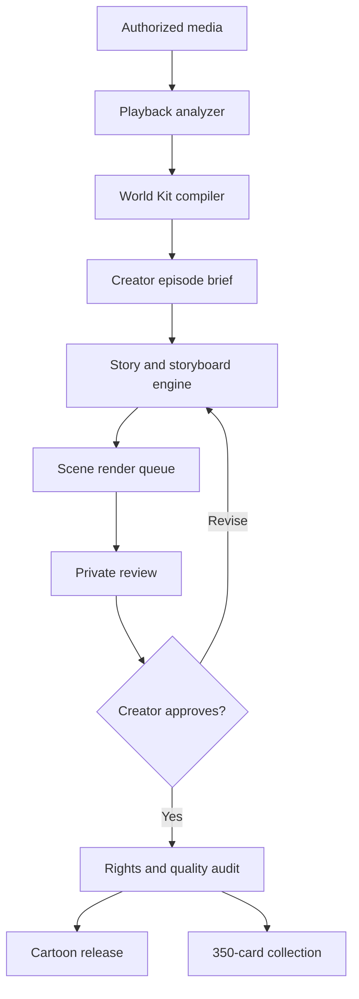

# Auto Built Cartoon Deployer

**Watch media. Describe the new episode. Build a private cartoon world and a collectible card set. Share only when the creator chooses.**

Auto Built Cartoon Deployer is a media-to-animation production system for StarQuest and the Infinity ecosystem. While authorized media is playing, the system studies its structure and prepares a reusable production package: characters, locations, props, relationships, scene grammar, sound cues, story beats, and card-ready moments. The creator can then supply a short episode idea and generate a new cartoon without rebuilding the entire world from the beginning.

The intended experience is simple:

```text
Watch → Analyze → Build world kit → Give episode context → Generate privately
      → Review → Create 350-card set → Publish/share → Watch or collect
```

The complicated work belongs behind the interface. The creator should not need to animate every frame, rewrite every character description, or manually prepare hundreds of card layouts.

## Example experience

A viewer finishes an authorized movie in StarQuest. During playback, Auto Built Cartoon Deployer has prepared a rights-aware production package describing:

- the story's characters and their relationships;
- recognizable locations and recurring objects;
- costume, color, lighting, and movement references;
- dialogue rhythm and vocabulary without copying the original script;
- important scene types and emotional beats;
- reusable original animation rigs;
- 350 possible card subjects.

When the movie ends, the viewer can choose either path:

1. **Build a cartoon episode** — enter a short premise, choose characters and length, then generate a private episode.
2. **Open the card collection** — inspect the 350-card checklist and buy a generated pack using Infinity after the set passes its publishing audit.

If the creator makes a new episode, it remains unseen by anyone else until the creator explicitly shares or publishes it. Published episodes may be watched with Star Coins. Shared episodes can also produce their own provenance-linked card subsets.

## Product principles

### Private first

Generation begins in a private workspace. Drafts, prompts, rejected scenes, reference frames, and unfinished episodes are not automatically public. Sharing, selling, and publishing are separate visible actions.

### Creator control

The creator controls:

- the episode premise;
- which approved characters and locations may appear;
- tone, audience rating, length, and learning goals;
- regeneration or manual replacement of any scene;
- whether a release is private, shared, listed, or withdrawn;
- whether cards are generated, packed, sold, or retained;
- which collaborators can view, edit, animate, approve, or publish.

### Reusable production intelligence

The expensive step is building a stable **World Kit**. Once approved, the same rigs, expression sheets, locations, props, palettes, and voice rules can support many fresh episodes. New scripts modify performance and story context without unnecessarily redesigning the entire cast.

### Rights-aware by construction

The system must distinguish between:

- original user-owned worlds;
- public-domain material;
- licensed properties and likenesses;
- user-authorized personal media;
- protected third-party films, characters, trademarks, voices, music, and celebrity likenesses.

Faithful character conversion is available only when the necessary rights or permissions are recorded. Otherwise the deployer creates an original cast and world that captures broad genre qualities without copying protected character designs, names, scripts, logos, voices, or a living artist's or studio's exact style.

The default art direction is an **original 1990s theatrical hand-drawn animation profile**: expressive silhouettes, clean ink lines, painted-background depth, warm cel shading, readable motion, and strong facial acting. It is a production profile, not a claim of affiliation with Disney or another studio.

## The generation pipeline

### 1. Media authorization

Before analysis begins, the source receives a rights state:

| State | Permitted output |
| --- | --- |
| Original/owned | Private and commercial generation, subject to participant releases |
| Licensed | Outputs allowed within recorded license scope |
| Public domain | Generation allowed; new additions remain separately tracked |
| Personal reference only | Private analysis and notes; no automatic public deployment |
| Unknown or restricted | Metadata-only cataloging until cleared |

The rights record travels with every derived asset and release.

### 2. Playback analysis

The analyzer processes only authorized inputs and records time-aligned observations:

- scene boundaries and shot types;
- characters present;
- dialogue speaker and emotional intent;
- location and time of day;
- important props and vehicles;
- action, gesture, and camera movement;
- music and sound-event categories;
- color and lighting profiles;
- plot events and unresolved threads;
- card-worthy compositions;
- content rating and safety signals.

Raw media does not need to be copied into the release package. The system stores references, derived measurements, approved reference crops when permitted, and hashes for provenance.

### 3. World Kit compiler

The compiler turns analysis into reusable production assets:

```text
World Kit
├── Rights manifest
├── Character bible
│   ├── Turnarounds
│   ├── Expression sheets
│   ├── Pose and motion library
│   ├── Costume variants
│   ├── Relationship rules
│   └── Voice/performance rules
├── Location bible
│   ├── Establishing views
│   ├── Reusable layouts
│   └── Lighting variants
├── Props and vehicles
├── Story grammar
├── Approved vocabulary
├── Animation profile
├── Card design system
└── Validation tests
```

Each asset has a stable identifier and version. A character update should not silently alter an already released episode.

### 4. Creator episode brief

The minimum viable input is deliberately small:

```text
Premise: The group must repair a school robot before the science fair.
Characters: Alex, Mina, Coach
Length: 7 minutes
Tone: Funny, inventive, family-friendly
Required event: The wrong capacitor makes the robot dance
Ending: The repair becomes the winning demonstration
```

Advanced controls remain optional: lesson goal, scene count, forbidden topics, selected locations, card emphasis, dialogue density, music profile, and continuity point.

### 5. Story engine

The story engine produces structured material before rendering expensive animation:

1. premise and continuity check;
2. beat sheet;
3. scene outline;
4. script and dialogue;
5. storyboard panels;
6. timing/animatic;
7. creator approval checkpoint;
8. final animation plan.

Every stage remains editable. A rejected line should regenerate the affected performance, not the entire episode.

### 6. Animation assembly

The renderer combines approved rigs and backgrounds with new performance data:

- character blocking;
- facial expressions and lip synchronization;
- pose interpolation and hand corrections;
- camera and parallax movement;
- lighting and effects;
- dialogue, music, and sound effects;
- captions and descriptive audio;
- final quality and continuity checks.

Rendering can happen in scene-sized jobs so a phone may supervise production without keeping one fragile request open.

### 7. Review and provenance

Before a creator can publish, the system displays:

- episode preview;
- rights/audit status;
- used World Kit version;
- generated and human-edited scenes;
- content rating;
- unresolved visual or audio defects;
- expected Star Coin price;
- proposed card-set relationship;
- release hash and creator signature.

### 8. Private release, sharing, and deployment

Release states are explicit:

```text
Draft → Private Preview → Approved → Shared Link → Listed → Archived
```

Nothing moves from private preview to shared or listed without creator approval. A shared viewer receives the final release, not the creator's hidden prompts, raw references, or rejected drafts.

## The 350-card engine

Each completed World Kit prepares a 350-card master checklist. Cards can represent:

- main and supporting characters;
- character expressions and costumes;
- locations and vehicles;
- props and inventions;
- story moments;
- episode milestones;
- behind-the-scenes production stages;
- educational explanations;
- rare alternates and creator cards.

The set is generated as structured card records before final artwork:

```json
{
  "cardId": "world-001-card-027",
  "setNumber": 27,
  "title": "The Capacitor Test",
  "subjectType": "story-moment",
  "worldKitVersion": "1.0.0",
  "episodeId": "episode-001",
  "artAssetId": "frame-approved-184",
  "rarity": "standard",
  "rightsState": "cleared",
  "provenanceHash": "sha256:..."
}
```

Cards failing the rights or quality audit cannot enter sellable packs. They remain blocked until replaced with cleared original material.

### Pack model

- The creator may inspect the checklist before packs exist.
- A pack contains a declared number of digital cards and published odds.
- Infinity is used to purchase collectible packs.
- Star Coins are used to access eligible cartoon episodes in StarQuest.
- Ownership, edition, transfer, and provenance are recorded separately from the artwork file.
- Payment logic must use an auditable ledger and never request a wallet recovery phrase.

## StarQuest integration

StarQuest supplies the viewing surface and, for authorized media, time-aligned playback events. The deployer returns:

- analysis progress that does not interrupt playback;
- an end-of-show **Build Cartoon** option;
- an end-of-show **Open Card Set** option;
- private episode previews;
- Star Coin watch-price metadata;
- share and creator pages;
- watch-history and release provenance links.

Background work must be queued and rate-limited. A failed analysis job cannot break video playback.

## Prototype scope

The first prototype should prove the full story with a small, rights-cleared test world rather than attempting feature-film rendering immediately.

### Prototype input

- one original or public-domain 3–5 minute source;
- three characters;
- two locations;
- six props;
- a recorded rights manifest;
- one 60–90 second creator-generated episode.

### Prototype output

- playback timeline analysis;
- World Kit JSON;
- three character reference sheets;
- two reusable background layouts;
- creator episode-brief form;
- beat sheet, script, and storyboard;
- low-frame-rate animatic with captions;
- ten fully rendered demonstration cards;
- the remaining 340 cards represented by valid checklist records;
- private preview and explicit share control;
- simulated Infinity pack checkout and Star Coin episode unlock;
- complete audit and provenance record.

The prototype does **not** need to render a full feature, impersonate protected voices, mint tokens, or process irreversible payments.

## Reference architecture



### Services

| Service | Responsibility |
| --- | --- |
| Ingest gateway | Authorizes sources and creates analysis jobs |
| Timeline analyzer | Produces time-coded scenes, cast, objects, actions, and beats |
| Rights engine | Enforces allowed use for each source and derived asset |
| World Kit compiler | Creates versioned reusable production assets |
| Story engine | Converts short creator context into structured episode plans |
| Render orchestrator | Splits animation into retryable scene jobs |
| Consistency checker | Detects character, costume, prop, and continuity drift |
| Card factory | Builds checklist records, art jobs, packs, and odds |
| Provenance ledger | Links source authorization, edits, releases, cards, and owners |
| StarQuest adapter | Presents episodes, cards, prices, history, and sharing |

## Core records

```text
SourceAsset
AnalysisTimeline
RightsManifest
WorldKit
CharacterAsset
LocationAsset
EpisodeBrief
ScriptVersion
StoryboardPanel
RenderJob
EpisodeRelease
CardSet
CardRecord
PackDefinition
CreatorApproval
LedgerEntry
```

Every record uses a stable ID, creator ID, timestamps, version, content hash, rights state, visibility state, and parent provenance.

## Suggested repository structure

```text
auto-built-cartoon-deployer/
├── README.md
├── SECURITY.md
├── LICENSE
├── docs/
│   ├── rights-model.md
│   ├── world-kit-schema.md
│   ├── card-set-schema.md
│   └── starquest-integration.md
├── apps/
│   ├── creator-mobile/
│   └── review-console/
├── services/
│   ├── analyzer/
│   ├── world-kit-compiler/
│   ├── story-engine/
│   ├── render-orchestrator/
│   ├── card-factory/
│   └── provenance-ledger/
├── packages/
│   ├── contracts/
│   ├── rights-policy/
│   ├── animation-profile-1990s/
│   └── starquest-adapter/
├── examples/
│   └── prototype-world/
└── tests/
```

## Safety and release requirements

- No public release without a resolved rights state.
- No unauthorized cloning of a person's voice or likeness.
- No generation marketed as an official studio production without authorization.
- No hidden publishing or automatic public sharing.
- No prompt, draft, or private-reference exposure to viewers.
- No card sale before art, rights, odds, price, and provenance validation.
- No irreversible token or payment action during prototype mode.
- Child-directed releases require stronger content, privacy, purchase, and advertising controls.
- Generated frames and dialogue require automated checks plus creator review.

## First build milestones

1. Define JSON schemas for source authorization, timeline events, World Kits, episodes, and cards.
2. Build a phone-readable creator brief with private-by-default projects.
3. Analyze one cleared short and produce a timeline.
4. Compile a three-character reusable World Kit.
5. Generate a beat sheet, script, storyboard, and animatic.
6. Approve individual scenes and rerender only rejected scenes.
7. Create ten finished cards plus a validated 350-card checklist.
8. Add simulated Infinity pack purchasing and Star Coin episode access.
9. Connect the private preview to a StarQuest test page.
10. Run rights, quality, accessibility, provenance, and Android usability tests.

## Prototype acceptance criteria

The first prototype is successful when:

- an authorized source can be analyzed without disrupting playback;
- a reusable World Kit is produced and versioned;
- a creator can describe an episode in five short fields;
- a private animatic is generated from that brief;
- one rejected scene can be regenerated independently;
- character appearance remains consistent across scenes;
- ten demonstration cards and 350 valid card records are created;
- blocked assets cannot be published or sold;
- no release becomes public without a creator action;
- the complete flow is readable and operable on an Android phone.

## Status

**Prototype specification.** The immediate goal is a small end-to-end demonstration using rights-cleared material. Scaling to feature-length media, full animation, large card catalogs, and public creator markets comes only after the World Kit, rights, provenance, and scene-retry systems are proven.

## Working principle

> The creator supplies the idea. The system carries the production memory. Nothing becomes public until the creator decides it is ready.
