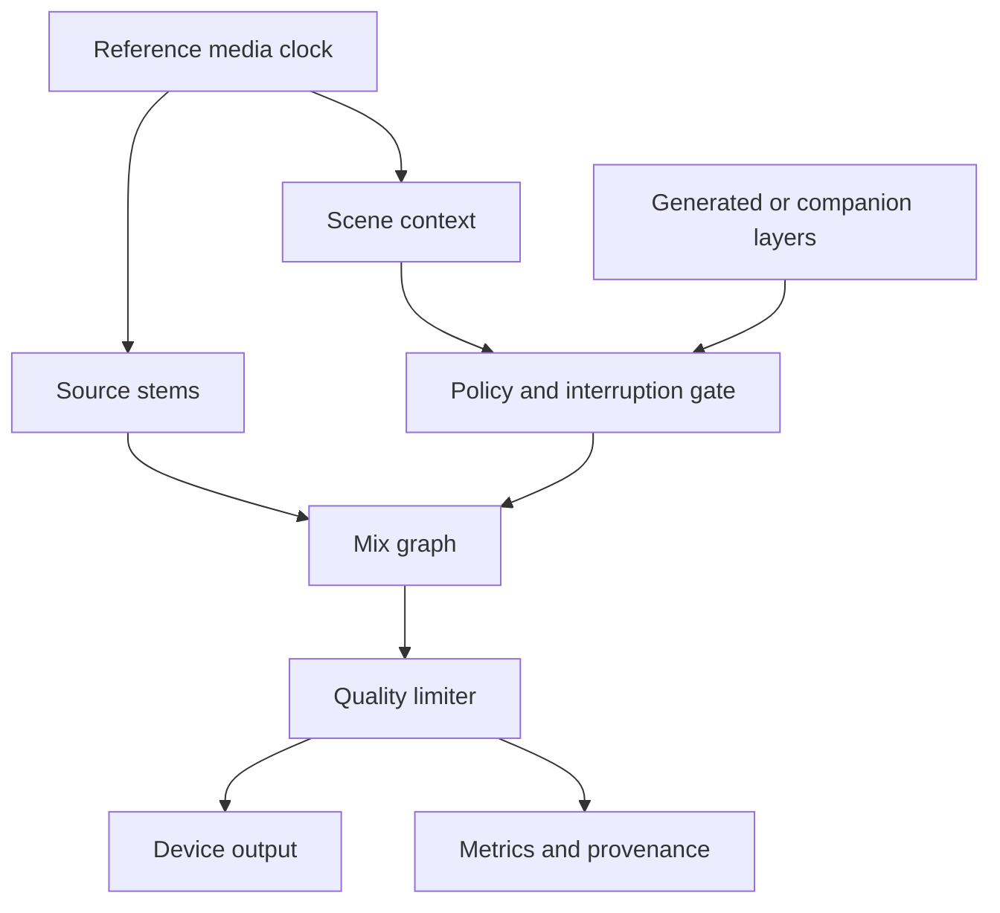
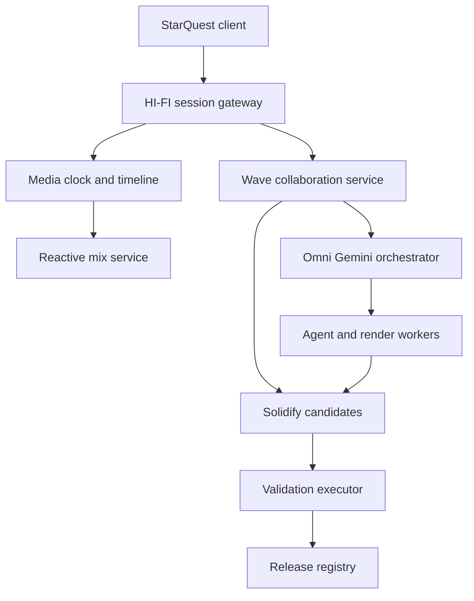

# Infinity HI-FI

**A reactive high-fidelity sound and multimodal production system for StarQuest—with Solidify turning live experiments into durable software projects.**

Infinity HI-FI begins as StarQuest's intelligent sound system. It listens to authorized playback events, scene context, dialogue, user interaction, device capability, and creator rules, then produces a synchronized listening environment that can change while the program plays.

It is also broader than a player enhancement. Infinity HI-FI is a real-time audio-visual production layer where soundscapes, commentary, accessibility tracks, generated media, code, and agent work can move through one versioned timeline. The accompanying **Solidify** interface promotes successful experiments from temporary sessions into named, testable, deployable projects.

## The idea in one flow

```text
StarQuest playback
      ↓
Scene and timing events
      ↓
Infinity HI-FI reactive audio engine
      ↓
Omni Gemini multimodal orchestration
      ↓
Wave-style production blips
      ↓
Solidify validation and project promotion
      ↓
Versioned release for StarQuest or another Infinity application
```

## Why it exists

Ordinary streaming sends one finished audio track to every listener. Infinity HI-FI treats the soundtrack as a controlled, layered acoustic environment.

Examples include:

- dialogue remaining clear when effects become loud;
- a room or headphone profile changing spatial reflections;
- Cosmo speaking at a safe opening in the dialogue;
- accessibility narration entering without covering important speech;
- educational explanations appearing at an experiment or invention;
- music and ambience responding to a StarQuest interaction;
- authorized alternate dialogue, language, or performance layers;
- a creator testing a new sound treatment and turning it into a reusable project.

The original program remains available as the reference mix. Reactive additions are optional, attributable, reversible, and synchronized to stable media time.

## Primary systems

### 1. Infinity HI-FI Engine

The engine receives media and context events and produces synchronized audio-visual layers.

It manages:

- lossless or high-resolution source audio when available;
- dialogue, music, effects, ambience, narration, and commentary stems;
- sample-accurate or frame-accurate timeline alignment;
- loudness, peak, phase, and latency controls;
- spatial sound and acoustic-room simulation;
- adaptive mixes for speakers, headphones, phone hardware, and accessibility;
- real-time generated layers with safe fallback to the original track;
- captions, transcripts, visualizers, and video-mask metadata;
- provenance for every generated or modified segment.

### 2. Wave Canvas

The production interface is a modern spiritual successor to Google Wave. Work is stored in concurrent, non-linear units called **blips** instead of one rigid chat thread.

A blip can contain:

- text or a conversation;
- code and test results;
- an audio stem or time range;
- a waveform annotation;
- a video frame or mask;
- a prompt and generated result;
- an agent handoff;
- a rights or approval decision;
- a Solidify candidate.

Blips can reply to, branch from, cite, merge with, or supersede one another without deleting the earlier production record.

### 3. Omni Gemini Orchestrator

Omni Gemini is the capability and handoff framework coordinating reasoning, generation, validation, publishing, and digital-signal-processing work. The name describes the custom orchestration contract; it does not require one model provider.

Each agent advertises capabilities rather than receiving unrestricted project access.

Core roles:

| Role | Responsibility |
| --- | --- |
| Reasoning | Interpret intent, scene context, constraints, and next actions |
| Generation | Produce text, audio, code, masks, images, or structured plans |
| DSP audio | Analyze, mix, filter, spatialize, and validate sound |
| Validation | Check schemas, timing, quality, safety, rights, and tests |
| Publishing | Package an approved immutable release |

### 4. Solidify

Solidify is the programming interface that converts temporary creative work into a durable project.

Solidify is maintained as a separate project and database at [`www-infinity4/Solidify`](https://github.com/www-infinity4/Solidify). Infinity HI-FI sends versioned Candidate and validation events to Solidify; it does not own Solidify's authoritative promotion history.

During exploration, creators may produce many blips, prompts, code fragments, stems, parameter changes, and agent results. Solidify gathers the selected pieces into a **Candidate**, resolves dependencies, freezes inputs, runs tests, records provenance, and—only after approval—promotes the Candidate to a versioned project release.

Solidify answers five questions:

1. What exactly are we keeping?
2. Which source versions and rights apply?
3. Can the result be reproduced?
4. Did it pass functional, media-quality, and safety checks?
5. Where is the approved build allowed to deploy?

## StarQuest experience

Infinity HI-FI must never make ordinary playback fragile. StarQuest starts the original media path first, then connects enhanced layers when ready.

### Playback lifecycle

1. StarQuest opens a playable source.
2. The media identity and duration are resolved.
3. A synchronized HI-FI session is created.
4. Available stems, captions, scene markers, and approved enhancements load.
5. Device and accessibility capabilities are detected locally.
6. The listener chooses a mix profile or keeps the original.
7. Reactive layers subscribe to playback time and state.
8. If any enhancement fails, the player continues with the reference track.
9. Listening position, chosen profile, and authorized project state are saved.

### Initial sound profiles

| Profile | Behavior |
| --- | --- |
| Original | Untouched reference mix |
| Clear dialogue | Raises speech intelligibility without flattening the whole program |
| Cinema headphones | Spatial presentation tuned for headphones |
| Phone speaker | Preserves dialogue and impact on limited hardware |
| Quiet night | Reduces extreme peaks while retaining detail |
| Accessible narration | Places description in safe dialogue openings |
| Cosmo companion | Allows approved contextual commentary at interruption-safe moments |
| Creator lab | Exposes stems and parameters for a private experiment |

## Reactive audio graph



The media clock is authoritative. Generated layers may be late or unavailable; they cannot redefine playback time.

## Multimodal event contract

All real-time messages share a common envelope:

```json
{
  "eventId": "evt_01J...",
  "sessionId": "session_01J...",
  "projectId": "starquest-hifi",
  "blipId": "blip_01J...",
  "type": "hifi.audio.segment",
  "mediaTimeMs": 184230,
  "sequence": 42,
  "producer": "dsp-audio-agent",
  "contentHash": "sha256:...",
  "createdAt": "2026-08-27T00:00:00Z",
  "payload": {}
}
```

Initial payload types:

- `text.delta`
- `code.execution`
- `hifi.audio.stream`
- `hifi.audio.segment`
- `agent.handoff`
- `yjs.update`
- `video.mask.render`
- `timeline.annotation`
- `candidate.status`
- `approval.request`
- `release.published`

Large binary media stays in object storage. Events carry immutable content references, hashes, timing, and metadata rather than forcing audio or video through the collaboration document.

## Omni Gemini capability contract

```json
{
  "agentId": "agent_dsp_01",
  "roles": ["dsp_audio", "validation"],
  "accepts": ["hifi.audio.segment", "timeline.annotation"],
  "produces": ["hifi.audio.segment", "validation.report"],
  "limits": {
    "maxDurationMs": 30000,
    "maxConcurrentJobs": 2,
    "network": false
  },
  "permissions": ["project:read", "candidate:write"],
  "version": "1.0.0"
}
```

An agent handoff includes the input references, expected output schema, lease duration, retry policy, cost/time budget, and stopping condition. Agents never receive authority merely because another agent mentions it in text.

## Run states and leases

Long-running media work uses explicit state:

```text
queued
  → claimed
  → running
  → handoff_pending
  → completed

recoverable: retry_wait
human decision: blocked
terminal: failed | cancelled
```

Claims use expiring leases. A crashed worker cannot hold a scene forever. Completion is idempotent: repeating a message with the same key returns the recorded result instead of producing another charge or duplicate asset.

## Wave collaboration model

The canvas uses a shared document model such as Yjs for concurrent text and structured state. Presence, cursors, blip structure, and small annotations belong in the shared document; final ledger records and large media do not.

### Blip record

```json
{
  "blipId": "blip_01J...",
  "parentIds": ["blip_01H..."],
  "kind": "audio-experiment",
  "authorType": "human",
  "authorId": "creator_01",
  "visibility": "private",
  "status": "active",
  "mediaRange": {"startMs": 181000, "endMs": 196000},
  "contentRefs": ["asset://audio/sha256/..."],
  "supersedes": null,
  "createdAt": "2026-08-27T00:00:00Z"
}
```

The client stores unsent updates in an IndexedDB outbox. Reconnection sends missing updates by stable ID, preventing phone connectivity loss from erasing work.

## Solidify workflow

### 1. Select

The creator selects blips, code, media layers, prompts, parameters, and decisions to preserve.

### 2. Resolve

Solidify produces a dependency graph and reports missing, mutable, incompatible, or unauthorized inputs.

### 3. Freeze

Every input becomes a content-addressed reference. Model versions, source commits, configuration, licenses, and environment contracts are recorded.

### 4. Build

The Candidate is assembled in an isolated job. Generated output is written to candidate storage, never directly over the active release.

### 5. Validate

Required checks include:

- schema and contract validation;
- unit and integration tests;
- audio duration and sample-rate checks;
- loudness, true-peak, clipping, phase, and silence detection;
- synchronization drift;
- accessibility track collision checks;
- rights and source-scope validation;
- malware and unsafe-code boundaries;
- Android performance budget;
- deterministic manifest and content hashes.

### 6. Preview

The creator compares the Candidate with the active version in StarQuest without exposing it publicly.

### 7. Approve and publish

Approval creates an immutable release manifest. Deployment is a separate authorized step. Rollback changes the active pointer to an earlier valid release; it does not erase history.

## Solidify candidate contract

```json
{
  "candidateId": "cand_01J...",
  "projectId": "starquest-hifi",
  "idempotencyKey": "project:source-hash:config-hash",
  "sourceBlips": ["blip_01J..."],
  "sourceCommit": "git:abc123",
  "assets": [
    {"uri": "asset://audio/sha256/...", "hash": "sha256:..."}
  ],
  "target": "starquest-preview",
  "status": "queued",
  "requiredChecks": ["contracts", "audio-quality", "sync", "rights", "android"],
  "createdBy": "creator_01"
}
```

### Promotion gate

```text
experiment → candidate → verified → approved → released
                    ↘ rejected
                    ↘ blocked
```

- **Rejected** means the Candidate itself failed a deterministic rule.
- **Blocked** means a required dependency, permission, service, or human decision is unavailable.

This distinction keeps infrastructure trouble from being mislabeled as bad creative work.

## Reference architecture



### Suggested prototype stack

- **FastAPI** for control APIs and WebSocket session endpoints;
- **Yjs** for concurrent blip/canvas state;
- **SQLite** for a local prototype, then PostgreSQL or D1 where deployment requires it;
- **object storage** for immutable audio, video, masks, reports, and snapshots;
- **Redis, Durable Objects, or equivalent coordination** for presence and leases;
- **queues** for DSP, generation, testing, and publishing jobs;
- **Web Audio API / AudioWorklet** for browser DSP and synchronized playback;
- **FFmpeg-based workers** for offline rendering and media validation;
- **OpenTelemetry-compatible traces** across session, blip, agent, candidate, and release IDs.

Provider choices may change. Contracts, hashes, timing rules, and state transitions are the stable architecture.

## Persistence

The earlier prototype name `wave_production_timeline.db` remains suitable for local development.

Minimum tables or logical collections:

```text
projects
sessions
timeline_ledger
blips
yjs_snapshots
agents
runs
leases
assets
candidates
validation_reports
approvals
releases
deployments
```

Infinity HI-FI database rows hold media-session metadata and working state. Candidate promotion, validation decisions, approvals, releases, and deployment history are authoritative in the separate Solidify database. Immutable media and large reports live in object storage and are referenced by hash from both systems.

## Security and privacy

- Playback media and generated layers require recorded authorization.
- Private Wave blips are not training data or public content by default.
- Agents receive scoped capabilities and expiring leases.
- Page, media, model, and agent output are treated as untrusted input.
- Publishing, purchases, rights changes, and public sharing require creator approval.
- Signed release manifests identify every input and output hash.
- Secrets remain in server-side configuration and never enter collaboration blips.
- Audio generation must not clone a person's voice without authorization.
- The reference track remains available when an enhancement is unsafe or unhealthy.

## Failure behavior

| Failure | Required result |
| --- | --- |
| Generated layer arrives late | Skip or crossfade safely; never pause reference playback |
| WebSocket disconnects | Continue local playback and queue collaboration updates |
| Agent lease expires | Requeue idempotently |
| Audio validation fails | Reject Candidate; retain report and active release |
| Rights information missing | Block publishing, not private structural work |
| Device is overloaded | Reduce enhancement quality before affecting playback |
| Deployment fails | Keep previous release active |

## Repository structure

```text
infinity-hi-fi/
├── README.md
├── SECURITY.md
├── docs/
│   ├── audio-protocol.md
│   ├── wave-blips.md
│   ├── omni-gemini-contract.md
│   ├── solidify-candidates.md
│   └── starquest-integration.md
├── apps/
│   ├── starquest-hifi-client/
│   ├── wave-canvas/
│   └── solidify-console/
├── services/
│   ├── session-gateway/
│   ├── timeline/
│   ├── mix-engine/
│   ├── orchestrator/
│   ├── validation-executor/
│   └── release-registry/
├── packages/
│   ├── contracts/
│   ├── audio-quality/
│   ├── capability-policy/
│   └── telemetry/
├── workers/
│   ├── dsp/
│   ├── generation/
│   └── publishing/
└── tests/
```

## First prototype

The first build should prove one complete, safe StarQuest enhancement rather than attempt every generative feature.

### Demonstration

Use one rights-cleared five-minute video with:

- a reference stereo track;
- dialogue and music/effects stems or a documented separation step;
- scene markers and captions;
- one optional Cosmo commentary event;
- Clear Dialogue and Original profiles;
- one creator-adjusted mix stored as a Wave blip;
- one Solidify Candidate promoted to a private StarQuest preview.

### Required deliverables

1. Shared event and capability schemas.
2. Media clock and WebSocket session prototype.
3. Web Audio mix graph with Original and Clear Dialogue modes.
4. Wave canvas holding text, audio-range, code, and handoff blips.
5. Omni Gemini worker lease and idempotent handoff demonstration.
6. Solidify Candidate builder.
7. Automated audio, synchronization, and contract validation.
8. Private preview with explicit approval.
9. Immutable release manifest and rollback pointer.
10. Android phone performance and readability report.

## Acceptance criteria

The prototype succeeds when:

- StarQuest reference playback never depends on an AI response;
- switching sound profiles remains synchronized;
- dialogue enhancement does not clip or drift;
- a generated companion segment can enter only at an approved time;
- two clients can edit different Wave blips concurrently;
- a failed or expired agent job retries without duplicating output;
- Solidify freezes every Candidate input by version and hash;
- failed validation cannot replace the active release;
- an approved Candidate opens as a private StarQuest preview;
- the complete control surface is usable on an Android phone.

## Roadmap

### Phase 1 — StarQuest sound system

Reference playback, media clock, Clear Dialogue, phone/headphone profiles, captions, and graceful fallback.

### Phase 2 — Reactive HI-FI

Scene events, acoustic spaces, accessibility narration, companion commentary, spatial sound, and generated layers.

### Phase 3 — Wave production canvas

Concurrent blips, time-range annotations, code execution records, audio previews, agent handoffs, and offline outbox.

### Phase 4 — Solidify

Dependency resolution, Candidate manifests, isolated builds, validation reports, private previews, releases, and rollback.

### Phase 5 — Infinity production network

Reusable HI-FI projects for StarQuest programs, Auto Built Cartoon Deployer, Instrument Lab, games, education, and creator-published sound experiences.

## Status

**Architecture and prototype specification.** StarQuest is the first deployment target. The contracts intentionally keep Infinity HI-FI, Wave collaboration, Omni Gemini orchestration, and Solidify separable so each system can be tested and improved without breaking ordinary media playback.

## Working principle

> Keep playback alive. Let sound react. Preserve every decision. Solidify only what can be explained, tested, and safely released.
