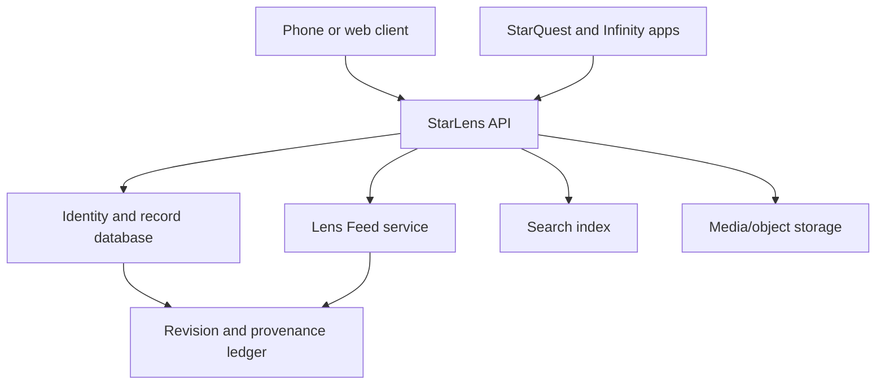

# StarLens

**Infinity's living media, creator, character, and project database—where every page also has an attributable public timeline.**

StarLens combines the durable reference value of IMDb with the immediacy of a social update feed. Movies, shows, episodes, songs, games, books, creators, performers, characters, inventions, studios, and Infinity projects receive structured pages. New trailers, credits, production notes, release updates, reviews, images, cards, corrections, and creator posts appear on the relevant page and in its chronological **Lens Feed**.

StarLens is not simply “IMDb plus Twitter.” The database and the feed are connected but distinct:

- **The Record** stores structured facts, credits, relationships, identifiers, rights, and provenance.
- **The Lens Feed** stores time-ordered posts, additions, corrections, discussions, and release events.
- **The Lens** combines both into one understandable page.

This distinction prevents a popular post from silently becoming an official credit while still allowing every meaningful addition to remain visible and discussable.

## Example

A StarQuest title page may contain:

- title, year, runtime, rating, genres, and synopsis;
- cast and crew credits;
- episode and season relationships;
- playable StarQuest source and availability state;
- soundtrack, cards, and related projects;
- rights and provenance status;
- reviews and audience reactions;
- a Lens Feed showing a new trailer, corrected credit, creator note, card-set release, HI-FI mix, or cartoon adaptation.

If an authorized creator adds a production image, that image appears in the page gallery and creates a feed event. If a community member proposes a credit correction, it appears as a labeled proposal until verified. If StarQuest publishes a new playable source, the availability record changes and a release event appears in the feed.

## Product principles

### Living pages

A StarLens page is not a frozen encyclopedia entry. It is a versioned identity that develops through attributable events.

### Facts and posts remain distinguishable

Structured credits, user opinions, creator announcements, AI-generated summaries, and disputed claims use different record types and visible labels.

### Provenance before popularity

Every important fact records its source, submitter, verification state, creation time, and revision history. Likes or reposts do not verify a claim.

### Creator control without historical erasure

Verified page owners can publish updates and manage their presentation, but they cannot quietly remove legitimate sourced history. Corrections supersede prior records while preserving the audit trail.

### StarQuest first, Infinity-wide later

StarQuest is the first major consumer. StarLens later supports Auto Built Cartoon Deployer, Infinity HI-FI, digital cards, games, books, research, music, and creator portfolios.

### Phone first

Pages, feeds, credits, editing, verification, and playback links must remain readable and operable on an Android phone with large controls and no hardware-keyboard requirement.

## What receives a Lens

| Entity | Examples |
| --- | --- |
| Title | Movie, series, short, episode, music video, broadcast |
| Person | Performer, director, writer, musician, engineer, creator |
| Character | Fictional or original character with rights-aware relationships |
| Organization | Studio, label, production company, school, Infinity project |
| Work | Song, album, book, game, card set, cartoon, research publication |
| Asset | Trailer, poster, approved image, audio mix, subtitle track |
| Release | Theater, broadcast, streaming, physical, StarQuest, HI-FI version |
| Collection | Franchise, season, playlist, 350-card set, museum exhibit |

Each entity receives a stable StarLens ID independent of its display name or current URL.

## Lens page anatomy

### Header

- canonical name and alternate names;
- verified badge and entity type;
- primary artwork;
- short description;
- availability and rights status;
- Follow, Save, Share, Watch, and Edit/Propose actions.

### Record

- structured facts;
- credits and roles;
- dates, places, organizations, and relationships;
- identifiers and external references;
- editions and releases;
- source citations and verification state;
- revision history.

### Lens Feed

- creator and organization posts;
- title announcements;
- trailers and approved media;
- credit additions and corrections;
- StarQuest availability changes;
- Infinity HI-FI release events;
- card-set and pack announcements;
- linked cartoon or game releases;
- reviews, replies, and community discussion;
- moderation and dispute outcomes when public notice is appropriate.

### Related universe

- cast, crew, characters, titles, episodes, music, cards, games, adaptations, production organizations, and source works;
- graph relationships explain how each item is connected.

## Feed behavior

Every feed item has one primary target Lens and may mention other Lenses. Events generated from database changes link to the exact revision.

### Feed item types

```text
post
announcement
release
credit-added
credit-corrected
availability-changed
review
reply
media-added
card-set-published
hifi-mix-published
cartoon-published
verification-update
dispute-opened
dispute-resolved
```

### Visibility

```text
private → collaborators → shared link → followers → public
```

Drafts never become public merely because they were added to a private project page.

### Following

Users may follow people, titles, characters, studios, projects, collections, or topics. The home feed combines followed Lens events with clearly labeled recommendations. Chronological view remains available.

## Record truth model

StarLens stores claims rather than pretending every submitted value is immediately true.

```text
proposed → sourced → verified
        ↘ disputed
        ↘ rejected
verified → superseded
```

| State | Meaning |
| --- | --- |
| Proposed | Submitted but not yet supported sufficiently |
| Sourced | Connected to a reviewable source |
| Verified | Accepted under the applicable verification rule |
| Disputed | A substantive conflict is under review |
| Rejected | Failed a factual, rights, identity, or policy check |
| Superseded | Replaced by a later record without deleting history |

Opinions and reviews do not need to become verified facts. They remain attributable opinions.

## Identity and page control

StarLens distinguishes:

- a person or organization's identity;
- the account operating on its behalf;
- the maintainers curating a page;
- contributors proposing changes;
- automated services posting system events.

Verification may establish control of an account or relationship to a project; it does not make every future statement factually correct. High-impact changes require stronger evidence or multiple reviewers.

## StarQuest integration

StarLens provides StarQuest with canonical media identity and context.

StarQuest can read:

- title and episode metadata;
- approved artwork;
- playable-source status;
- cast, characters, genres, keywords, and content notices;
- captions and audio-profile relationships;
- card sets and related Infinity projects;
- creator announcements and release events.

StarQuest can write attributable events for:

- a newly verified playable source;
- source removal or availability failure;
- Infinity HI-FI profile publication;
- an authorized Auto Built Cartoon release;
- a 350-card checklist or pack release;
- creator-approved watch milestones when privacy settings allow.

Playback must not depend on the feed service. If StarLens is unavailable, StarQuest uses cached title metadata and continues playing.

## Infinity economy

StarLens catalogs economic relationships without hiding prices or confusing access with ownership.

- Star Coins may unlock eligible StarQuest episodes or experiences.
- Infinity may purchase eligible digital card packs, creator releases, or listed products.
- Following, reading pages, proposing corrections, and viewing ordinary database facts do not require payment.
- Ownership, access permission, edition, transfer, and provenance are separate records.
- No page may request a wallet recovery phrase, seed phrase, or private key.
- Prices, odds, royalties, and rights state must be visible before a purchase.

## Cards and collections

A card set receives its own Lens with:

- set title and description;
- publisher and creators;
- checklist size;
- card records and numbers;
- related title, person, character, and episode Lenses;
- pack configuration and published odds;
- rights and audit state;
- provenance and release history;
- museum or collection relationships.

A card image cannot become sellable merely because it is attached to a page. Publication requires cleared rights, valid provenance, quality approval, and the applicable pack/release contract.

## Reviews and ratings

StarLens separates several measures:

- user rating;
- written review;
- verified-watch rating when StarQuest can confirm completion with permission;
- critic or publication review;
- technical quality assessment;
- accessibility assessment;
- community trust signals.

The calculation method and sample size are visible. Rating manipulation, duplicate accounts, purchased engagement, and coordinated abuse are monitored without hiding legitimate disagreement.

## Moderation and safety

- Personal attacks, threats, harassment, impersonation, doxxing, and non-consensual intimate material are prohibited.
- Allegations about real people require careful sourcing, neutral presentation, and a dispute path.
- Unverified claims are not promoted as biography facts.
- Minors receive stronger privacy and contact protections.
- AI-generated images, summaries, reviews, voices, and posts are labeled.
- Protected media, trademarks, characters, and likenesses require appropriate authorization for commercial reuse.
- Page maintainers cannot use moderation to erase sourced corrections or criticism solely because it is unfavorable.
- Appeals and moderation actions receive stable case IDs and audit events.

## Data model

```text
LensEntity
├── CanonicalIdentity
├── Claim[]
├── Credit[]
├── Relationship[]
├── Release[]
├── Availability[]
├── MediaAsset[]
├── FeedEvent[]
├── Review[]
├── CollectionMembership[]
├── Verification[]
├── RightsRecord[]
└── Revision[]
```

### Core entity

```json
{
  "lensId": "lens_01J...",
  "entityType": "title",
  "canonicalName": "Example Film",
  "slug": "example-film-2026",
  "verificationState": "verified",
  "visibility": "public",
  "currentRevisionId": "rev_01J...",
  "createdAt": "2026-08-27T00:00:00Z",
  "updatedAt": "2026-08-27T00:00:00Z"
}
```

### Feed event

```json
{
  "eventId": "event_01J...",
  "lensId": "lens_01J...",
  "actorId": "account_01J...",
  "eventType": "credit-corrected",
  "body": "Updated the credited role after source review.",
  "revisionId": "rev_01J...",
  "mentions": ["lens_person_01J..."],
  "visibility": "public",
  "verificationLabel": "system-record",
  "createdAt": "2026-08-27T00:00:00Z"
}
```

## Reference architecture



### Services

| Service | Responsibility |
| --- | --- |
| Identity service | Stable Lens IDs, slugs, aliases, verification, ownership |
| Record service | Claims, credits, relationships, releases, revisions |
| Feed service | Posts, database events, follows, replies, timelines |
| Search service | Titles, people, credits, characters, works, and feed discovery |
| Media service | Approved images, trailers, audio, captions, hashes, rights |
| Moderation service | Reports, cases, appeals, enforcement, safety labels |
| Provenance service | Sources, contributors, revisions, signatures, audit history |
| Infinity adapter | StarQuest, HI-FI, cards, cartoons, wallet-safe product links |

## Suggested repository structure

```text
starlens/
├── README.md
├── SECURITY.md
├── docs/
│   ├── record-truth-model.md
│   ├── feed-events.md
│   ├── identity-verification.md
│   ├── moderation.md
│   └── starquest-integration.md
├── apps/
│   ├── mobile-web/
│   └── moderation-console/
├── services/
│   ├── api/
│   ├── records/
│   ├── feed/
│   ├── search/
│   └── provenance/
├── packages/
│   ├── contracts/
│   ├── permissions/
│   └── infinity-adapter/
├── migrations/
└── tests/
```

## First prototype

The prototype should use a small rights-cleared catalog:

- five titles;
- ten people or creator profiles;
- five characters;
- one organization;
- one StarQuest playable-source relationship;
- one Infinity HI-FI release;
- one 350-card set shell;
- structured credits and relationships;
- feed events automatically generated from record changes;
- user posts, follows, reviews, replies, and correction proposals;
- phone-first search and page navigation.

## First build milestones

1. Define Lens IDs, entity types, claims, credits, relationships, and revisions.
2. Build title, person, character, organization, and collection pages.
3. Create the Lens Feed and database-change event generator.
4. Add sources and claim verification states.
5. Add follows, posts, replies, reviews, and chronological timelines.
6. Implement correction proposals and moderator review.
7. Connect one StarQuest title and availability record.
8. Connect one Infinity HI-FI release and one card-set Lens.
9. Add search, aliases, and relationship navigation.
10. Test Android readability, privacy, abuse handling, provenance, and offline caching.

## Acceptance criteria

- Every page and feed item uses a stable ID.
- A database edit creates a linked, attributable feed event.
- A feed post cannot silently become a verified credit.
- Credits retain sources and revision history.
- Disputed claims are visibly labeled and reviewable.
- Verified owners can post without controlling unrelated factual review.
- StarQuest can resolve a title even if the feed is unavailable.
- Infinity HI-FI and card releases appear as typed relationships, not loose text.
- Private drafts do not enter public feeds.
- The main page, search, feed, editing, and review flows work on an Android phone.

## Status

**Architecture and prototype specification.** The first release should establish trustworthy records and attributable timelines before adding large-scale recommendations or monetization.

## Working principle

> Every work has a record. Every addition has an author. Every page has a living timeline.
